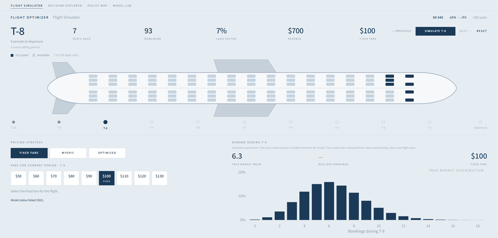
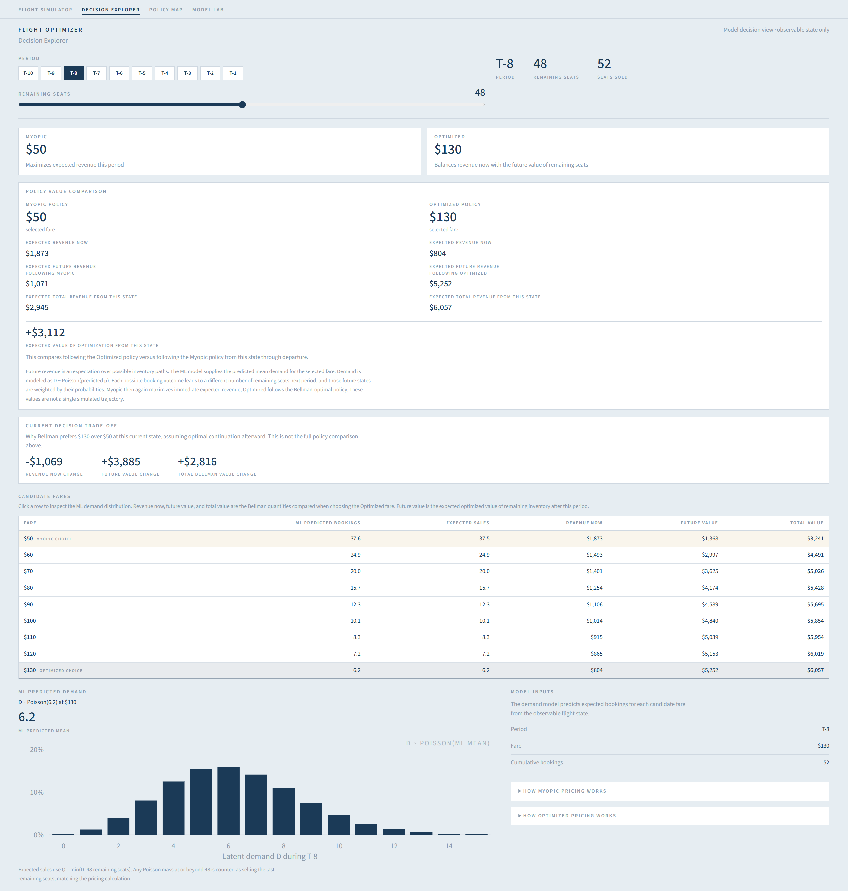
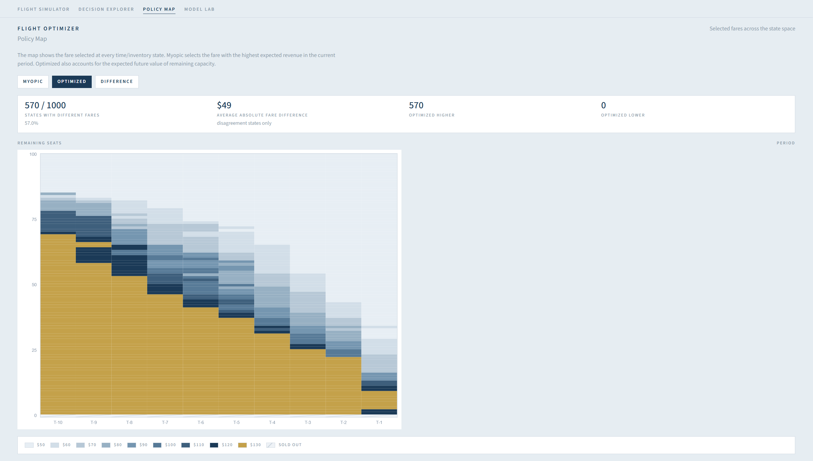
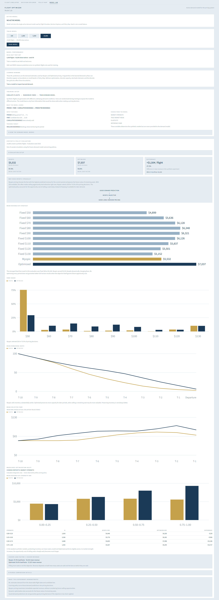

# Flight Pricing Optimizer

An interactive machine learning and revenue optimization project that explores how an airline can set fares over time when demand is uncertain and aircraft capacity is limited.

The project separates the pricing problem into two parts:

- a machine learning model that predicts demand from observable flight state and candidate fare
- a pricing policy that uses those predictions to choose a fare

Three pricing strategies can be compared:

- **Fixed Fare** — uses the same fare throughout the booking horizon
- **Myopic Pricing** — selects the fare with the highest predicted immediate revenue at that time step
- **Dynamic Pricing** — uses Bellman optimization to account for both current revenue and the future value of remaining seats up until departure

The application includes an interactive flight simulator, a decision explorer, a policy map, and a model lab for retraining and evaluating the demand model.

> **Current version:** synthetic airline market with 100-seat flights and 10 booking periods, data generated from simulated price-sensitive demand with stochastic booking outcomes, a gradient-boosted demand model, and dynamic programming for sequential pricing.

## Live demo

[Open the deployed application](https://flight-pricing-optimizer.thankfulsand-6fed6a90.germanywestcentral.azurecontainerapps.io/)

## Demo

### Flight Simulator

### Decision Explorer

### Policy Map

### Model Lab

## How it works

The synthetic market generates stochastic bookings as a function of time to departure, fare, and an unobserved flight-specific demand strength.

The ML model does not observe this hidden demand strength. It learns from simulated historical data using only:

- booking period
- candidate fare
- cumulative bookings

Training data are generated using randomized fares across the available price levels.

The trained model predicts expected bookings for each candidate fare. A Poisson distribution is then used to represent demand uncertainty.

The pricing policies use the same demand model but optimize different objectives:

**Myopic pricing**

Chooses the fare that maximizes predicted revenue in the current period:

`fare × expected bookings for that fare`

**Dynamic pricing**

Uses Bellman optimization to account for the opportunity cost of selling a seat now rather than keeping it available for future periods:

`current expected revenue + expected future value of remaining capacity`

This makes it possible to demonstrate an important revenue-management principle: a good demand model does not by itself guarantee good pricing decisions. The objective used to turn predictions into actions also matters.

## What the project demonstrates

- Demand modeling under price-sensitive stochastic demand
- Machine learning from observable booking-state information
- Randomized-price training data
- Gradient-boosted demand prediction
- Probabilistic demand modeling
- Capacity-constrained airline revenue management
- Myopic versus sequential pricing decisions
- Bellman dynamic programming
- Opportunity cost of remaining capacity
- Policy visualization and model diagnostics

## Tech stack

- Python
- FastAPI
- scikit-learn
- SciPy
- NumPy
- Next.js
- React
- TypeScript
- Docker
- Azure Container Registry
- Azure Container Apps

